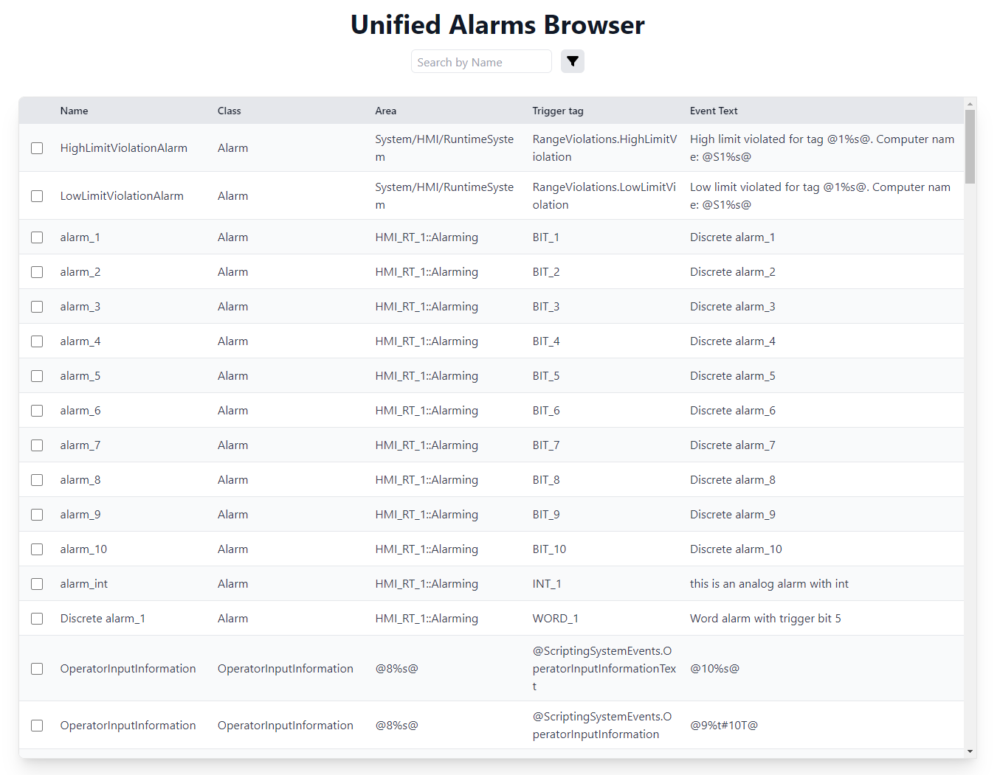
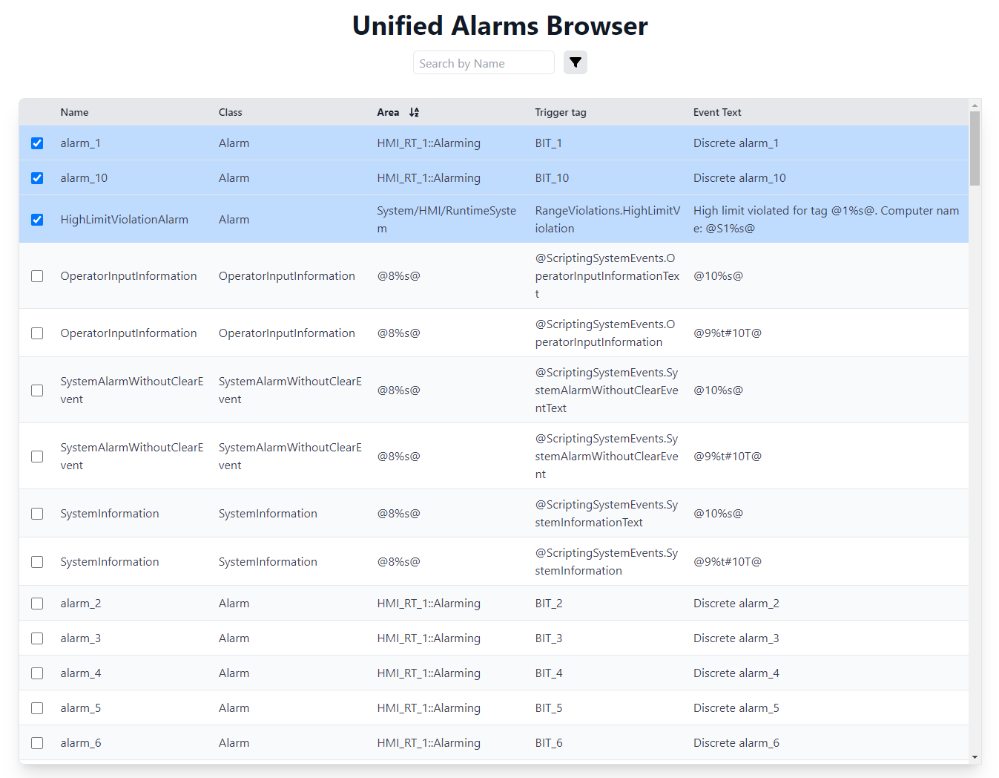
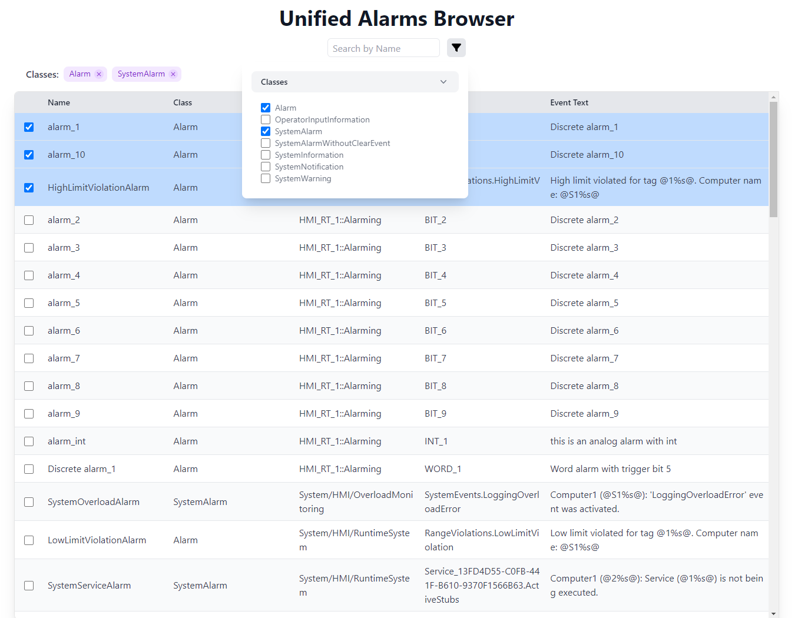

# Unified Alarms Browser 

## Description
This is a simple frontend application that allows users to search for configured alarms in WinCC Unified PC or Unified Comfort Panels.
It provides a user-friendly interface to input search criteria and display the matching alarms.
The frontend requests the data from my openpipe-api REST API, which makes use of the openpipe connector to get the data from the WinCC Unified system.

## Technologies Used
- React
- Vite
- WinCC Unified Open Pipe
- Node.js

## Screenshots

